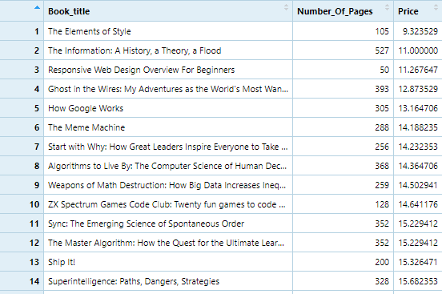
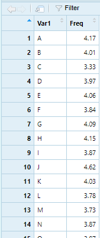
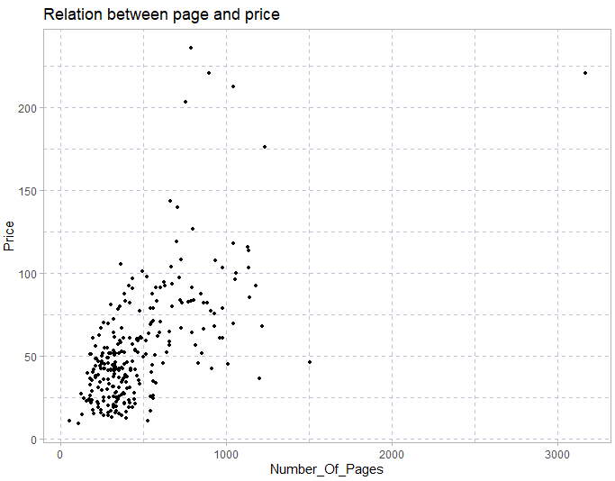
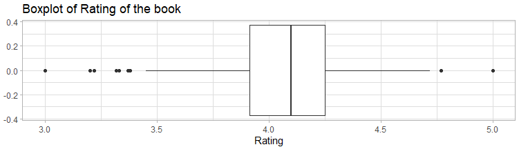

# R-Assignment 4
**Created by Piraya Sutthiparinyanon (ID: 63130500087)**

Choose Dataset: 
- Top 270 Computer Science / Programing Books
    - [Data in kaggle](https://www.kaggle.com/thomaskonstantin/top-270-rated-computer-science-programing-books)
    - [Data in csv (in my github repository)](data.csv)

## Part A: Finding Insight the data in R

### Outlines
1. Explore the dataset
2. Tranform data with tidyverse's function and finding insight data
3. Visualization with ggplot2

### Part1: Explore the dataset
ใน dataset นี้ มีหนังสือเกี่ยวกับ computer science แบะ ในเครือการ programming ทั้งหมด 270 เล่มที่ได้รับความนิยม
ข้อมูลที่ได้มานี้ถูกรวบรวมจากเว็บไซต์ชื่อดัง 

**Importing library and dataset**

```
# Importing library
library(DescTools) # For better use in exploring data + more function
library(readr) #for reading csv
library(stringr) #in case of changing of data format
library(dplyr) #for %>% uses
library(ggplot2) #for plotting graph
library(tibble) #for learning
library(tidyr) #for learning

#Importing dataset
Books <- read_csv("https://raw.githubusercontent.com/sit-2021-int214/027-Quickest-Electric-Cars/main/assignment/Homework04/HW04_63130500087/data.csv")
View(Books)
```
\
**Explore dataset**
```
glimpse(Books)
```
\
After we glimpse the dataset we found that
| |Column Name|Column's detail|Data type|
|----|------|-------|----|
|1|Rating|Book's rating. Its range is between [0,5]|numeric|
|2|Review|The number's of review on this book|double|
|3|Book_title|Book's name|character|
|4|Description|Book's description|character
|5|Number_Of_Pages|Number of pages in the book|numeric|
|6|Type|The type of book (eg. hardcover / ebook / kindle book etc.)|character|
|7|Price|Average price of book in USD (calculated from 5 web sources)|numeric|

This data is nearly completely to be cleaned already. There is a few problem

1. the Column **Type** should be factor instead of character since it has its categories.
2. **Column Type** of data **row 270** , should discard "Boxed Set" from "Boxed Set - Hardcover".
3. In column Review, there are some of data that its review is 0. I'm not sure that if it mistake or not. In the end I leave this part untouch.
4. Some column should be arrange the orders

These problem will be fix in the next part.

### Part2: Tranform data with tidyverse's function and finding insight data
In tidyverse there are library :
1. `dplyr`
2. `ggplot2`
3. `tibble`
4. `tidyr`
5. `readr`
6. `purr`
7. `forcats`
etc.

And will use `stringr` to cooperate

**In class syntax**
- `read_csv` from readr (use at the beginning part : importing csv data)
Explain :
- It work as same as `read.csv` which is use for reading file in csv data into RStudio
  
----------------
- `%>%` from dplyr
- `str_remove` and `str_trim` from stringr
```
#Clean data column "Type" cleaned the word "Box set"
Books$Type <- Books$Type %>% str_remove("Boxed Set -") %>% str_trim()
View(Books)
```

Explain :
- `%>%` work as passing the syntax to one another. In this example, the `Books$Type` ill be send to `str_remove` and `str_trim` by order.
- `str_remove` work as removing the exact string (or other type) from the data. In this example `str_remove("Boxed Set -")` will remove the word "Boxed Set - " from the row
- `str_trim` work as removing white space in front / back of the data in the row. In this example, will trim the data in row Type.

*At this part there is changes in the data  data in row 270 in column type was cleaned*

----------------------------
- `as.factor` for changing character into factor
```
#Change data type in column Type
Books$Type %>% is.factor() #FALSE
Books$Type <- as.factor(Books$Type)
glimpse(Books)
```
Answer:
```
Rows: 271
Columns: 7
$ Rating          <dbl> 4.17, 4.01, 3.33, 3.97, 4.06, 3.84, 4.09, 4.15, 3.87, 4.62, 4.~
$ Reviews         <dbl> 3829, 1406, 0, 1658, 1325, 117, 5938, 1817, 2093, 0, 160, 481,~
$ Book_title      <chr> "The Elements of Style", "The Information: A History, a Theory~
$ Description     <chr> "This style manual offers practical advice on improving writin~
$ Number_Of_Pages <dbl> 105, 527, 50, 393, 305, 288, 256, 368, 259, 128, 352, 352, 200~
$ Type            <fct> Hardcover, Hardcover, Kindle Edition, Hardcover, Kindle Editio~
$ Price           <dbl> 9.323529, 11.000000, 11.267647, 12.873529, 13.164706, 14.18823~
```

Explain :
- `as.factor` work as convert the exact column into factor datatype. For easier to manage the data.

*At this part there is changes about the datatype of the data in the column type from character -> factor*

----------------------------
- `filter` from dplyr for showing specified condition.
```
#filtering data
#Eg: show data of table that its type is ebook
Books %>% filter(Type == "ebook")
```
Answer:
```
# A tibble: 7 x 7
  Rating Reviews Book_title        Description               Number_Of_Pages Type  Price
   <dbl>   <dbl> <chr>             <chr>                               <dbl> <fct> <dbl>
1   5          0 Your First App: ~ "A tutorial for real-wor~             317 ebook  25.9
2   4.16      33 Algorithms Unloc~ "For anyone who has ever~             237 ebook  34.4
3   4.31     161 Learn You a Hask~ "Learn You a Haskell for~             176 ebook  36.7
4   4.15      18 From Mathematics~ "In this substantive yet~             320 ebook  41.4
5   3.91      57 Effective Progra~ "Jeff Atwood began the C~             283 ebook  54.7
6   4.45      88 Deep Learning     "An introduction to a br~             787 ebook  83.2
7   4.02       3 Practical Founda~ "Ebook is freely availab~             582 ebook  83.2
```

Explain :
- `filter` , speak easily, work as same as WHERE in SQL syntax. It work as filtering / choosing in data that match which the condition.
- In this example, we choose the data which its type is "ebook" only

----------------------------

- `rename` from dplyr for renaming the column
```
#renaming column
#Eg: change column "Book_title" into "Title"
Books %>% rename("Title" = Book_title)
```
Answer:
```
# A tibble: 271 x 7
   Rating Reviews Title              Description            Number_Of_Pages Type   Price
    <dbl>   <dbl> <chr>              <chr>                            <dbl> <fct>  <dbl>
 1   4.17    3829 The Elements of S~ "This style manual of~             105 Hardc~  9.32
 2   4.01    1406 The Information: ~ "James Gleick, the au~             527 Hardc~ 11   
 3   3.33       0 Responsive Web De~ "In Responsive Web De~              50 Kindl~ 11.3 
 4   3.97    1658 Ghost in the Wire~ "If they were a hall ~             393 Hardc~ 12.9 
 5   4.06    1325 How Google Works   "Both Eric Schmidt an~             305 Kindl~ 13.2 
 6   3.84     117 The Meme Machine   "What is a meme? Firs~             288 Paper~ 14.2 
 7   4.09    5938 Start with Why: H~ "Why do you do what y~             256 Hardc~ 14.2 
 8   4.15    1817 Algorithms to Liv~ "A fascinating explor~             368 Hardc~ 14.4 
 9   3.87    2093 Weapons of Math D~ "A former Wall Street~             259 Hardc~ 14.5 
10   4.62       0 ZX Spectrum Games~ "This book is ideal f~             128 Paper~ 14.6 
# ... with 261 more rows
```
Explain :
- `rename` work as renaming the column
- In the example, the column `Book_title` was changed to `Title`

----------------------------

- `select` from dplyr for selecting specified column of data
```
#selecting specified column
SelectedBooks <- Books %>% select(Book_title,Number_Of_Pages,Price)
View(SelectedBooks)
```
Answer:

Explain :
- `select` work as same as SELECT statement in SQL syntax. Choosing the exact column of data.
- In this example, the chosen column is Book_title, Number_of_Pages, Price. So the result will show only those 3 columns.
----------------------------

- `group_by` from dplyr for grouping the same data together
- `summarise` from dplyr for calculating the summary autonomically.
```
#grouping + summarise
#Eg: find number of page group by type of book
Books %>% group_by(Type) %>% summarise(mean(Number_Of_Pages))
```
Answer:
```
  Type            `mean(Number_Of_Pages)`
  <fct>                             <dbl>
1 ebook                              386 
2 Hardcover                          617.
3 Kindle Edition                     283.
4 Paperback                          407.
5 Unknown Binding                    249 
```
Explain :
- `group_by` work as same as GROUP BY in SQL syntax. Grouping the data which is same together
- `summarise` work as returning the data in summary : mean, max, min etc.
- In this example, we group the data in Type using group_by and find the summary 'mean' of the data Number_of_page

---------------------------------

**Self study syntax**

- `write.csv` is the simple function for writeting csv file from R.
  It result will give the csv file
```
write.csv(Books,"BookCleaned", row.names = FALSE)
```
Answer:
- See the cleaned data at [BookCLeaned.csv](https://github.com/sit-2021-int214/027-Quickest-Electric-Cars/blob/main/assignment/Homework04/HW04_63130500087/BookCleaned.csv)

----------------------------

- `arrange` form dplyr for arranging order
- `desc` from dplyr for declaring descending order inside arrange
```
#Arranging order
Books %>% arrange(desc(Rating))
```
Answer:
```
# A tibble: 271 x 7
   Rating Reviews Book_title           Description           Number_Of_Pages Type  Price
    <dbl>   <dbl> <chr>                <chr>                           <dbl> <fct> <dbl>
 1   5          0 Your First App: Nod~ "A tutorial for real~             317 ebook  25.9
 2   4.77       4 The Art of Computer~ "\"The bible of all ~            3168 Hard~ 220. 
 3   4.72     362 Designing Data-Inte~ "Want to know how th~             616 Pape~  45.6
 4   4.67       1 Build Web Applicati~ "This book is primar~             372 Pape~  42.3
 5   4.67      78 Fluent Python: Clea~ "Python's simplicity~             792 Pape~  64.1
 6   4.62       0 ZX Spectrum Games C~ "This book is ideal ~             128 Pape~  14.6
 7   4.62      28 The Linux Programmi~ "The Linux Programmi~            1506 Hard~  46.4
 8   4.58      58 CLR via C# (Develop~ "Dig deep and master~             863 Pape~  66.3
 9   4.54      52 The Elements of Com~ "This book is based ~             325 Hard~  41.3
10   4.54     171 Practical Object Or~ "The Complete Guide ~             247 Pape~  50.1
# ... with 261 more rows
```
Explain :
- `arrange` work as same as ORDER BY in SQL syntax. It work as arranging / sorting the data by specified column.
- `desc` will be added if we want the data sorting in descending order (High to low).
- In this example, we sort the data in descending order from the column "Rating"

----------------------------

- `count` from dplyr for count number of data (simailar to normal count but can use with other dplyr functions).
```
#Counting by group
Books %>% group_by(Type) %>% count()
```
Answer:
```
  Type                n
  <fct>           <int>
1 ebook               7
2 Hardcover          96
3 Kindle Edition     10
4 Paperback         156
5 Unknown Binding     2
```

---------------------------

- `distinct` from dplyr for showing distinct data from dataset. (Similar to SQL SELECT distinct)
```
#distinct data
Books %>% distinct(Type)
```
Answer:
```
  Type           
  <fct>          
1 Hardcover      
2 Kindle Edition 
3 Paperback      
4 ebook          
5 Unknown Binding
```
Explain : 
- `distinct` work as same as DISTINCT in SELECT statement in SQL, not displaying the data repeatly. 

----------------------------

- `is.tbl` from dplyr for checking if the data inserting is table or not?
```
#Check if data is table?
is.tbl(Books) #true : csv is table
is.table(3) #false : numeric is not table
is.table(c(1,2,3)) #false : vector is not table
```
Answer:
```
> is.tbl(Books) #true : csv is table
[1] TRUE
> is.table(3) #false : numeric is not table
[1] FALSE
> is.table(c(1,2,3)) #false : vector is not table
[1] FALSE
```
Explain :
- `is.tbl` work as checking the data that inserted whether it is table or not.
- In this example, there are 3 example as above
---------------------------

- `pull` from dplyr for pulling a column with data (similar to select but the result isn't in table form)
- `as.table` from dplyr for convert the data into table form
```
#Pulling a column
BookRating <- Books %>% pull(Rating) %>% as.table()
View(BookRating)
```


------------------------------

- `cols_condense` from readr for seeing datatype and head of the data. Work as same as `glimpse` from dplyr but with another format
(glimpse list column downwards but cols_condense list sidewards)
```
#cols_condense
cols_condense(Books)
```
Answer:
```
  Rating Reviews Book_title           Description          Number_Of_Pages Type   Price
    <dbl>   <dbl> <chr>                <chr>                          <dbl> <fct>  <dbl>
 1   4.17    3829 The Elements of Sty~ "This style manual ~             105 Hardc~  9.32
 2   4.01    1406 The Information: A ~ "James Gleick, the ~             527 Hardc~ 11   
 3   3.33       0 Responsive Web Desi~ "In Responsive Web ~              50 Kindl~ 11.3 
 4   3.97    1658 Ghost in the Wires:~ "If they were a hal~             393 Hardc~ 12.9 
 5   4.06    1325 How Google Works     "Both Eric Schmidt ~             305 Kindl~ 13.2 
 6   3.84     117 The Meme Machine     "What is a meme? Fi~             288 Paper~ 14.2 
 7   4.09    5938 Start with Why: How~ "Why do you do what~             256 Hardc~ 14.2 
 8   4.15    1817 Algorithms to Live ~ "A fascinating expl~             368 Hardc~ 14.4 
 9   3.87    2093 Weapons of Math Des~ "A former Wall Stre~             259 Hardc~ 14.5 
10   4.62       0 ZX Spectrum Games C~ "This book is ideal~             128 Paper~ 14.6 
# ... with 261 more rows
```
-----------------------------------

- `spec` from readr for seeing datatype with readr format
```
#spec
spec(Books)
```
Answer:
```
cols(
  Rating = col_double(),
  Reviews = col_number(),
  Book_title = col_character(),
  Description = col_character(),
  Number_Of_Pages = col_double(),
  Type = col_character(),
  Price = col_double()
)
```
-------------------------------
- for `tidyr` and `tibble` library's purpose seem to mainly use for data frame.
- for `purr` I can install packages due to Rstudio version.

### Part3: Visualization with ggplot2
**1. Graph show relation between number of pages and price**
```
#Graph show relation between Number of page, price and types of books
books_scat <- Books %>% ggplot(aes(x=Number_Of_Pages,y=Price)) + 
  geom_point(size = 1)
#Adding component
books_scat <- books_scat + ggtitle("Relation between page and price")
##Play with the decoration
books_scat <- books_scat + theme_light() + 
  theme(panel.grid = element_line(color = "#bfc3d6",
                                  size = 1,
                                  linetype = "dashed"))
#Result
books_scat
```
Result :


Explain :

- From this relation you will see the scatter plot graph by ggplot2. Doing :
  - create graph, adding point
  - add title
  - add theme and decoration
- You will see that the data scatter over the graph, much of the data is at the bottom left
- It also leads to conclusion that there are correlation that if number of page increase, the price also increase too.


**2. Graph show the data of Rating in the boxplt form**
```
#boxplot
books_box <- Books %>% ggplot(aes(x=Rating)) + geom_boxplot()
#Adding component
books_box <- books_box + ggtitle("Boxplot of Rating of the book")
##Play with the decoration
books_box <- books_box + theme_light() 
#Result
books_box
```

Result :


Explain :

- From this relation you will see the box plot graph by ggplot2. Doing :
  - create graph, adding point
  - add title
  - add theme and decoration
- You will see that the data is really spread (high variance). Rating's mean is around 4.0
- There are 9 outliers, higher than upper limit and less than lower limit.


## Part B: Creting interaction dashboard with ...... tools
This is my interaction dashboard : [Computer science dashboard result]()


