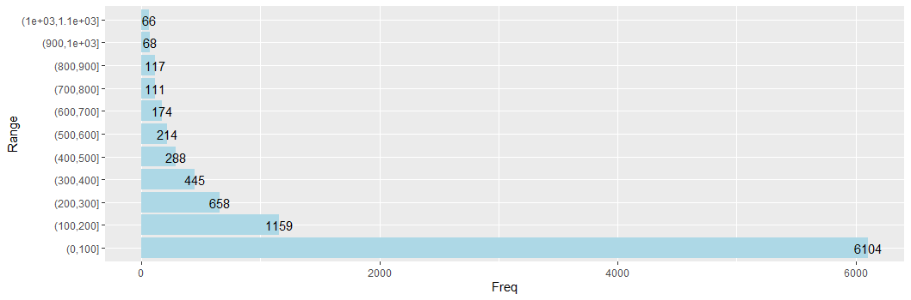

# R-Assignment 4

**Created by Name-Surname (ID: 63130500106)**

Choose Dataset:
* Superstore Sales Dataset (Data from Rohit Sahoo,[Kaggle](https://www.kaggle.com/rohitsahoo/sales-forecasting)) >> [Using CSV](https://raw.githubusercontent.com/safesit23/INT214-Statistics/main/datasets/superstore_sales.csv)
* [Data in csv (in my github repository)](train.csv)


### Outlines
1. Explore the dataset
2. Learning function from Tidyverse
3. Transform data with dplyr and finding insight the data
4. Visualization with ggplot2

## Part 1: Explore the dataset
ใน dataset นี้ เป็นชุดข้อมูลเกี่ยวกับการค้าปลีกของ Superstore ระดับโลกเป็นเวลา 4 ปี เพื่อใช้คาดการณ์ยอดขายในอีก 7 วันข้างหน้าจากวันสุดท้ายของชุดข้อมูล และใช้เป็นประโยชน์ในเชิงข้อมูลเศรษฐกิจ ข้อมูลสภาพอากาศ ราคาหุ้น และการพยากรณ์ยอดขายปลีก

```R
# Import library
library(DescTools)  #exploring data
library(readr)      #read .csv file
library(stringr)    #data cleaning and data transformation
library(dplyr)      #for %>% uses
library(ggplot2)    #use plot graph

#Import dataset
Orders <- read_csv("https://raw.githubusercontent.com/sit-2021-int214/027-Quickest-Electric-Cars/main/assignment/Homework04/HW04_63130500106/train.csv")

#Explore dataset
View(Orders)
glimpse(Orders)

```
ใน dataset นี้ เป็นชุดข้อมูลที่เข้าใจง่ายและมีข้อมูลที่ค่อนข้างจะสมบูรณ์มาก ไม่มีข้อมูลไหนตกลงหายไปในแต่ละแถว
แต่จะพบว่ามีจำนวนข้อมูลทั้งหมด 9,800 rows และมีทั้งหมด 18 columns ได้แก่
| |Column Name|Column's detail|Data type|
|----|------|-------|----|
|1|Row ID|เลขที่ของแถว|double|
|2|Order ID|เลขที่ของใบสั่งซื้อ|character|
|3|Order Date|วันที่ของใบสั่งซื้อ|character|
|4|Ship Date|วันที่จัดสั่ง|character|
|5|Ship Mode|รูปแบบการจัดส่ง(เช่น First Class,Second Class,Standard Class)|character|
|6|Customer ID|รหัสประจำตัวของลูกค้า|character|
|7|Customer Name|ชื่อลูกค้า|character|
|8|Segment|ประเภทของลูกค้าประเภทของลูกค้าที่สั่งซื้อ(เช่น Consumer,Corporate,Home Offices)|character|
|9|Country|ประเทศที่ลูกค้าอาศัยอยู่|character|
|10|City|เมืองที่ลูกค้าอาศัยอยู่|character|
|11|State|รัฐที่ลูกค้าอาศัยอยู่|character|
|12|Postal Code|รหัสไปรษณีย์|double|
|13|Region|ภูมิภาค|character|
|14|Product ID|รหัสของสินค้า|character|
|15|Category|ประเภทของสินค้า(เช่น Furniture,Technology,Office Supplies)|character|
|16|Sub-Category|หมวดหมู่ย่อยของสินค้า|character|
|17|Product Name|ชื่อสินค้า|character|
|18|Sales|ราคาที่สั่งซื้อ|double|

- แต่เนื่องจากข้อมูลนี้มีข้อมูลที่ต้องจัดประเภท จึงต้องมีการ Changing the types of values เป็นค่าที่เหมาะสม ก่อนที่จะนำข้อมูลชุดนี้ไปวิเคราะห์
```R
#Changing the types of values
Orders$`Order Date`<-as.Date(Orders$`Order Date`,format = "%d/%m/%Y")
Orders$`Ship Date`<-as.Date(Orders$`Ship Date`,format = "%d/%m/%Y")
Orders$`Ship Mode`<-as.factor(Orders$`Ship Mode`)
Orders$Segment<-as.factor(Orders$Segment)
Orders$Country<-as.factor(Orders$Country)
Orders$City<-as.factor(Orders$City)
Orders$State<-as.factor(Orders$State)
Orders$Region<-as.factor(Orders$Region)
Orders$Category<-as.factor(Orders$Category)
Orders$`Sub-Category`<-as.factor(Orders$`Sub-Category`)

table(Orders$`Ship Mode`)
table(Orders$Segment)
table(Orders$Country)
table(Orders$City)
table(Orders$State)
table(Orders$Region)
table(Orders$Category)
table(Orders$`Sub-Category`)
```
## Part 2: Learning function from Tidyverse (Self study syntax)
Tidyverse มี package ดังนี้
- `ggplot2`
- `dplyr`
- `tidyr`
- `readr`
- `tibble`
- `stringr`
- `forcats`

### Package `dplyr` 
- `group_by()` : จัดกลุ่มข้อมูล
- `group_keys()` : ดูชื่อของแต่ละกลุ่ม
- `tally()` : นับจำนวนข้อมูลของแต่ละกลุ่ม
```R
Orders %>% group_by(Region) %>% group_keys()
Orders %>% group_by(Region) %>% tally(sort = TRUE)
```

### Package `forcats`
- `fct_infreq()` : ใช้การจัดลำดับข้อมูลตามความถี่
```R
Orders %>%
  mutate(state = fct_infreq(State)) %>%
  count(state)
```

### Package `ggplot2`
- `theme_dark()` : ปรับพื้นหลังกราฟเป็นสีเข้ม
- `coord_flip()` : ใช้สลับแกน x กับแกน y
```R
Orders %>%
  ggplot(aes(x = `Sub-Category`)) + 
  geom_bar(fill="blue") + 
  theme_dark()+
  coord_flip()
```
- `theme_void()` : เอาพื้นหลังกราฟออก
- `coord_polar()` : ทำเป็นกราฟวงกลม
- `geom_text()` : เพิ่มข้อมูลบนรูปกราฟ
```R
totalPrice_year <- Orders %>% 
  mutate(year = Year(Orders$`Order Date`)) %>% 
  group_by(year) %>% summarise(Sum_price = sum(Sales)) %>% arrange(year)

totalPrice_year %>%
  ggplot(aes(x=year,y=Sum_price))+ 
  geom_bar(stat = "identity") +
  theme_void()+
  coord_polar()+
  geom_text(aes(label = Sum_price), position = position_identity())
```

## Part 3: Transform data with dplyr and finding insight the data
0. เช็คว่ามีค่า NA
```R
Orders$Country<-as.factor(Orders$Country)
summary(Orders$Country)
```
Result:
```
   Row ID         Order ID       Order Date      Ship Date      
 Mode :logical   Mode :logical   Mode :logical   Mode :logical  
 FALSE:9800      FALSE:9800      FALSE:9800      FALSE:9800     
                                                                
 Ship Mode       Customer ID     Customer Name    Segment       
 Mode :logical   Mode :logical   Mode :logical   Mode :logical  
 FALSE:9800      FALSE:9800      FALSE:9800      FALSE:9800     
                                                                
  Country           City           State         Postal Code    
 Mode :logical   Mode :logical   Mode :logical   Mode :logical  
 FALSE:9800      FALSE:9800      FALSE:9800      FALSE:9789     
                                                 TRUE :11       
   Region        Product ID       Category       Sub-Category   
 Mode :logical   Mode :logical   Mode :logical   Mode :logical  
 FALSE:9800      FALSE:9800      FALSE:9800      FALSE:9800     
                                                                
 Product Name      Sales        
 Mode :logical   Mode :logical  
 FALSE:9800      FALSE:9800  
```
**Explain** >> มีแค่คอลัมธ์ Postal Code ที่พบค่า NA จำนวน 11 ข้อมูล

------
1. ประเทศใดมีการสั่งซื้อมากที่สุดในชุดข้อมูลนี้ 
```R
Orders$Country<-as.factor(Orders$Country)
summary(Orders$Country)
```
Result:
```
United States 
         9800 
```
**Explain** >> มีแค่ประเทศสหรัฐอเมริกาประเทศเดียวที่มีข้อมูลในชุดข้อมูลนี้

-------

2. เลือกดูข้อมูลที่เกี่ยวกับสินค้าทั้งหมดที่เคยถูกสั่งซื้อในชุดข้อมูลนี้ พร้อมตัดข้อมูลที่ซ้ำกันออก
```R
Orders %>% select(`Product ID`,Category,`Sub-Category`,`Product Name`) %>% distinct()
```
Result:
```
# A tibble: 1,893 x 4
   `Product ID`    Category        `Sub-Category` `Product Name`                       
   <chr>           <chr>           <chr>          <chr>                                
 1 FUR-BO-10001798 Furniture       Bookcases      Bush Somerset Collection Bookcase    
 2 FUR-CH-10000454 Furniture       Chairs         Hon Deluxe Fabric Upholstered Stacki~
 3 OFF-LA-10000240 Office Supplies Labels         Self-Adhesive Address Labels for Typ~
 4 FUR-TA-10000577 Furniture       Tables         Bretford CR4500 Series Slim Rectangu~
 5 OFF-ST-10000760 Office Supplies Storage        Eldon Fold 'N Roll Cart System       
 6 FUR-FU-10001487 Furniture       Furnishings    Eldon Expressions Wood and Plastic D~
 7 OFF-AR-10002833 Office Supplies Art            Newell 322                           
 8 TEC-PH-10002275 Technology      Phones         Mitel 5320 IP Phone VoIP phone       
 9 OFF-BI-10003910 Office Supplies Binders        DXL Angle-View Binders with Locking ~
10 OFF-AP-10002892 Office Supplies Appliances     Belkin F5C206VTEL 6 Outlet Surge     
# ... with 1,883 more rows
```
**Explain** >> สินค้าที่เคยถูกสั่งซื้อทั้งหมดมีจำนวน 1,893 ชิ้น

-------

3. จัดอันดับยอดรวมราคาสั่งซื้อของแต่ละภูมิภาค ว่าภูมิภาคใดมียอดรวมราคาสั่งซื้อมากที่สุด(เรียงข้อมูลจากมากไปน้อย)
```R
Orders %>% group_by(Region) %>% select(Region,Sales) %>% summarise(Sum_price = sum(Sales)) %>% arrange(desc(Sum_price))
```
Result:
```
# A tibble: 4 x 2
  Region  Sum_price
  <fct>       <dbl>
1 West      710220.
2 East      669519.
3 Central   492647.
4 South     389151.
```
**Explain** >> การจัดอันดับยอดรวมราคาสั่งซื้อของแต่ละภูมิภาค มีดังนี้
- อันดับ 1 : ภาคตะวันตกของประเทศสหรัฐมียอดรวมราคาสั่งซื้อมากที่สุด คือ 710,220 ดอลลาร์สหรัฐ
- อันดับ 2 : ภาคตะวันออกของประเทศสหรัฐมียอดรวมราคาสั่งซื้อ 669,519 ดอลลาร์สหรัฐ
- อันดับ 3 : ภาคกลางของประเทศสหรัฐมียอดรวมราคาสั่งซื้อ 492,647 ดอลลาร์สหรัฐ
- อันดับ 4 : ภาคใต้ออกของประเทศสหรัฐมียอดรวมราคาสั่งซื้อ 389,151 ดอลลาร์สหรัฐ

-------

4. ลูกค้าคนใดมีการสั่งซื้อสินค้าแบบ First Class บ่อยที่สุด
```R
Orders %>% filter(`Ship Mode`=="First Class") %>% group_by(`Customer Name`) %>% tally(sort = TRUE) %>% head(1)
```
Result:
```
# A tibble: 1 x 2
  `Customer Name`     n
  <chr>           <int>
1 Clytie Kelty       14
```
**Explain** >> Clytie Kelty เป็นลูกค้าที่มีการสั่งซื้อสินค้าแบบ First Class บ่อยที่สุด (จำนวน 14 ครั้ง)

-------

5. จัดอันดับหมวดหมู่สินค้าที่มียอดการสั่งซื้อบ่อยครั้งมากที่สุด 5 อันดับ
```R
Orders %>% select(Category,`Sub-Category`) %>% 
  group_by(`Sub-Category`,Category) %>% tally(sort = TRUE) %>% rename(count=n) %>% head(5)
```
Result:
```
# A tibble: 5 x 3
# Groups:   Sub-Category [5]
  `Sub-Category` Category        count
  <fct>          <fct>           <int>
1 Binders        Office Supplies  1492
2 Paper          Office Supplies  1338
3 Furnishings    Furniture         931
4 Phones         Technology        876
5 Storage        Office Supplies   832
```
**Explain** >> จัดอันดับหมวดหมู่สินค้าย่อยที่มียอดการสั่งซื้อบ่อยครั้งมากที่สุด 5 อันดับ มีดังนี้
- อันดับ 1 : Binder
- อันดับ 2 : Paper
- อันดับ 3 : Furnishings
- อันดับ 4 : Phones
- อันดับ 5 : Storage

-------
6. จงหายอดขายสินค้าของแต่ละปี
```R
Orders %>% 
  mutate(year = Year(Orders$`Order Date`)) %>% 
  group_by(year) %>% summarise(Sum_price = sum(Sales)) %>% arrange(year)
```
Result:
```
# A tibble: 4 x 2
   year Sum_price
  <int>     <dbl>
1  2015   479856.
2  2016   459436.
3  2017   600193.
4  2018   722052.
```
**Explain** >>
- ปี 2015 มียอดขายรวมทั้งหมด 479,856 ดอลลาร์สหรัฐ
- ปี 2016 มียอดขายรวมทั้งหมด 459,436 ดอลลาร์สหรัฐ
- ปี 2017 มียอดขายรวมทั้งหมด 600,193 ดอลลาร์สหรัฐ
- ปี 2018 มียอดขายรวมทั้งหมด 722,052 ดอลลาร์สหรัฐ

-------

## Part 4: Visualization with GGplot2
### 1.) กราฟแสดงสัดส่วนของประเภทลูกค้าที่เคยสั่งซื้อสินค้าในช่วง 4 ปีที่ผ่านมา
```R
group_segment <- data.frame(table(Orders$Segment))
group_segment <- group_segment %>% rename("segment"=Var1,"count"=Freq)

group_segment %>% 
  ggplot(aes(x="",y=count,fill=segment)) + 
  geom_bar(stat="identity", width=1, color="white") +
  coord_polar("y", start=0)+
  theme_void() +
  geom_text(aes(label = percent(count/sum(count))),
                position = position_stack(vjust = 0.5))
```
Result:


### 2.) กราฟแสดงความถี่ในการสั่งซื้อของของลูกค้า ในแต่ละช่วงราคา
```R
SalePrice <- Orders %>% select(Sales)
col1<-table(cut(SalePrice$Sales,breaks=seq(from=0.0,to=10000,by=100)))
col2<-data.frame(col1)
col2<-col2 %>% rename("Range"=Var1)

col2 %>% filter(Freq > 50) %>%
  ggplot(aes(x=Range,y=Freq))+ 
  geom_bar(fill="#add8e6",stat = "identity")+
  coord_flip()+
  geom_text(aes(label = Freq), position = position_identity())
```
Result:



### 3.) กราฟแสดงยอดรวมราคาสินค้าที่สั่งซื้อในแต่ละปี
```R
totalPrice_year <- Orders %>% 
  mutate(year = Year(Orders$`Order Date`)) %>% 
  group_by(year) %>% summarise(Sum_price = sum(Sales)) %>% arrange(year)

totalPrice_year %>%
  ggplot(aes(x=year,y=Sum_price))+ 
  geom_bar(fill="#228B22",stat = "identity") +
  geom_text(aes(label = Sum_price), position = position_identity()) + 
  coord_flip()+
  theme_light()+
  ggtitle("Total price each year of SaleStore")+
  xlab("Years") + ylab("Total price")
```
Result:


