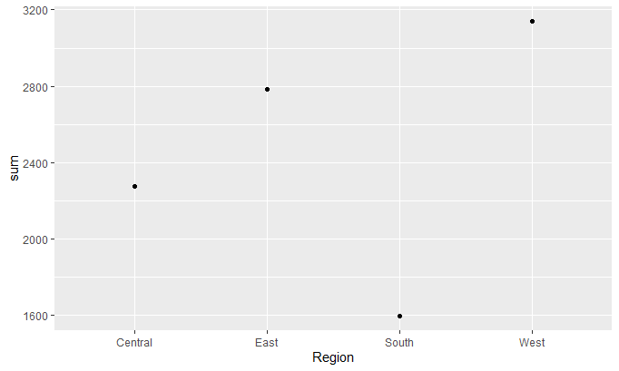
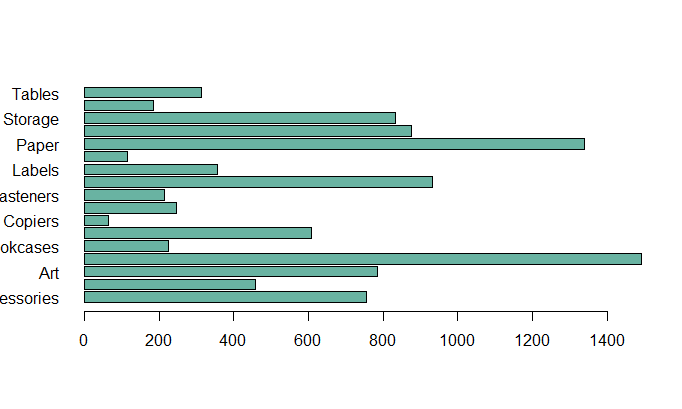

# R-Assignment 4

**Created by Ketdara (ID: 63130500149)**


Choose Dataset:
** Superstore Sales Dataset (Data from Rohit Sahoo,[Kaggle](https://www.kaggle.com/rohitsahoo/sales-forecasting)) >> [Using CSV](https://raw.githubusercontent.com/safesit23/INT214-Statistics/main/datasets/superstore_sales.csv)


### Outlines
1. Explore the dataset
2. Learning function from Tidyverse
3. Transform data with dplyr and finding insight the data
4. Visualization with GGplot2

## Part 1: Explore the dataset
Retail dataset of a global superstore for 4 years.
Perform EDA and Predict the sales of the next 7 days from the last date of the Training dataset.
``` R
# Library
library(ggplot2)
library(dplyr)
library(readr)
library(forcats)
# Load Dataset
SuperStoreSales <- read.csv("https://raw.githubusercontent.com/safesit23/INT214-Statistics/main/datasets/superstore_sales.csv")
View(SuperStoreSales)

In this dataset have 9800 observations and 18 variables


## Part 2: Learning function from Tidyverse
### Use Package 'forcats'
``` R
SuperStoreSales %>%
  mutate(Ship.Mode = fct_lump(Ship.Mode, n = 5)) %>%
  count(Ship.Mode, sort = TRUE)
``` 

## Part 3: Transform data with dplyr and finding insight the data
1.  
** Explain ** : แสดงข้อมูลของเมืองที่ชื่อว่า “New York” และมีรหัสไปรษณีย์ 10024 
``` R
SuperStoreSales %>% select(State,Postal.Code) %>% 
  filter(State=="New York", Postal.Code==10024) 
```
Output : 225 Rows (just show 20 rows in here)
```
 State Postal.Code
1   New York       10024
2   New York       10024
3   New York       10024
4   New York       10024
5   New York       10024
6   New York       10024
7   New York       10024
8   New York       10024
9   New York       10024
10  New York       10024
11  New York       10024
12  New York       10024
13  New York       10024
14  New York       10024
15  New York       10024
16  New York       10024
17  New York       10024
18  New York       10024
19  New York       10024
20  New York       10024
```
-------
2. 
** Explain ** : ค่าเฉลี่ยของsales ที่ขายไปทั้งหมดนั้น
``` R
mean(SuperStoreSales$Sales)
```
Output : 230.7691
```
-------
3.
** Explain ** : วันขนส่งสินค้าในวันที่ 09/12/2017 สินค้าที่เป็น phone ถูกส่งไปเท่าใด โดยให้แสดง รหัสของลูกค้า ชื่อลูกค้า และ segment นั้นด้วย 
``` R
SuperStoreSales %>% group_by(Ship.Date=="09/12/2017") %>%
  select(Customer.ID,Customer.Name,Segment,Sub.Category) %>% 
  filter(Sub.Category=="Phones") 
```
Output : 866 Rows (just show 10 rows in here)
``` 
`Ship.Date == "09/12/2017"` Customer.ID Customer.Name      Segment     Sub.Category
   <lgl>                       <chr>       <chr>              <chr>       <chr>       
 1 FALSE                       BH-11710    Brosina Hoffman    Consumer    Phones      
 2 FALSE                       BH-11710    Brosina Hoffman    Consumer    Phones      
 3 FALSE                       ZD-21925    Zuschuss Donatelli Consumer    Phones      
 4 FALSE                       GH-14485    Gene Hale          Corporate   Phones      
 5 FALSE                       SN-20710    Steve Nguyen       Home Office Phones      
 6 FALSE                       LC-16930    Linda Cazamias     Corporate   Phones      
 7 FALSE                       LH-16900    Lena Hernandez     Consumer    Phones      
 8 FALSE                       JM-15265    Janet Molinari     Corporate   Phones      
 9 FALSE                       BS-11590    Brendan Sweed      Corporate   Phones      
10 FALSE                       JS-15685    Jim Sink           Corporate   Phones 
```

-------
4.
  ** Explain ** : category ที่มีชื่อว่า Furniture ได้ถูกขายเฉลี่ยแล้วเท่าใด
``` R
SuperStoreSales %>% select(Category,Sales) %>% filter(Category=="Furniture") %>%
  summarise(Sales = mean(Sales, na.rm = TRUE))
```
Output : 350.6538
```

-------
5.
  ** Explain ** : ภูมิภาคในcolumnที่ชื่อว่า Region มีประเภทใด แล้วแต่ละประเภทมีทั้งหมดเท่าใด
``` R
SuperStoreSales %>% group_by(Region) %>% summarise(sum = n())
```
Output : 
```
# A tibble: 4 x 2
  Region    sum
  <chr>   <int>
1 Central  2277
2 East     2785
3 South    1598
4 West     3140
```
-------
6.
  ** Explain ** : วันขนส่งสินค้าในวันที่ 09/12/2017 สินค้าที่เป็น phone ถูกส่งไปเท่าใด โดยให้แสดง รหัสของลูกค้า ชื่อลูกค้า และ segment นั้นด้วย 
``` R
SuperStoreSales %>% group_by(Sub.Category) %>%select(Order.Date,Sub.Category,Sales) %>%
              summarise(quantity = n())
```
Output :
```
    Sub.Category quantity
   <chr>           <int>
 1 Accessories       756
 2 Appliances        459
 3 Art               785
 4 Binders          1492
 5 Bookcases         226
 6 Chairs            607
 7 Copiers            66
 8 Envelopes         248
 9 Fasteners         214
10 Furnishings       931
11 Labels            357
12 Machines          115
13 Paper            1338
14 Phones            876
15 Storage           832
16 Supplies          184
17 Tables            314
```

-------
## Part 4: Visualization with GGplot2
### 1.) กราฟแสดงปริมาณของคนในแต่ละภูมิภาคว่ามีมากน้อยเพียงใด
```
HiRegion <- data.frame (SuperStoreSales %>% group_by(Region) %>% summarise(sum = n()))
View(HiRegion)
HiRegion %>% ggplot(aes(x=Region,y=sum))+geom_point()
scat_plot <- HiRegion %>% 
  ggplot(aes(x=Region,y=sum))+geom_point()
scat_plot
scat_plot+geom_point(alpha = 10) 
```
Result:


** Details : HiRegion <- data.frame (SuperStoreSales %>% group_by(Region) %>% summarise(sum = n()))
View(HiRegion)
HiRegion %>% ggplot(aes(x=Region,y=sum))+geom_point() #ใช้สร้างกราฟที่เป็นจุด
# แถน x ใช้ข้อมูลregion ส่วนแกนy ใช้ข้อมูลจากคอลัมม์ sum ที่มาจากHiRegion ด้วยกันทั้งคู่
scat_plot <- HiRegion %>% 
  ggplot(aes(x=Region,y=sum))+geom_point() #เอาข้อมูลที่สร้างไปใส่ไว้ใน scat_plot แทนเวลาเรียกใช้จะได้ง่ายๆ
scat_plot #เรียกดูกราฟ
scat_plot+geom_point(alpha = 10) #เอาไว้กำจัดเวลามีจุดมากๆ จะทำให้ดูง่ายขึ้นตามที่ปรับขนาด
------- 

 ### 2.) กราฟแท่งแสดงปริมาณของหมวดหมู่ย่อยของสินค้าว่าถูกสั่งมากน้อยแค่ไหน
 ```
Subquanlity <- data.frame (SuperStoreSales %>% group_by(Sub.Category) %>%
  select(Customer.ID,Customer.Name,Segment,Sub.Category)%>% summarise(quanlity = n()))

barplot ( height=Subquanlity$quanlity, names=Subquanlity$Sub.Category ,
         col="#69b3a2",
         horiz=T, las=1)
```
Result:

       
 **Details : 
 - สร้าง dataframe แยกออกมาเฉพาะข้อมูลที่เราอยากรู้ จะได้ไม่ซับซ้อน 
โดย Subquanlity นั้นจะมีสองคอลัมม์ด้วยกัน คือชื่อของ Sub..Category และจำนวนของSub.Categoryแต่ละประเภท
Subquanlity <- data.frame (SuperStoreSales %>% group_by(Sub.Category) %>%
  select(Customer.ID,Customer.Name,Segment,Sub.Category)%>% summarise(quanlity = n()))
#กราฟที่เป็นแท่ง
barplot ( height=Subquanlity$quanlity, names=Subquanlity$Sub.Category ,
         col="#69b3a2",
         horiz=T, las=1) #horiz คือค่าตรรกะ หากเป็น FALSE แถบจะถูกวาดในแนวตั้งโดยให้แถบแรกอยู่ทางซ้าย หากเป็น TRUE แท่งจะถูกวาดในแนวนอนโดยให้แท่งแรกอยู่ด้านล่าง
- height ความสูงคือเปรียบได้กับแกนxเป็นค่าของSub.Categoryที่ถูกสั่งออเดอร์มา ใช้ข้อมูลที่มาจาก Subquanlity$quanlity และ names คือชื่อของสินค้ามาจาก Subquanlity$Sub.Category     
- las คือargument อนุญาตให้เปลี่ยนการวางแนวของป้ายกำกับแกน • 0: ขนานกับแกนเสมอ 1: แนวนอนเสมอ, 2: ตั้งฉากกับแกนเสมอ , 3: เสมอแนวตั้ง.
สิ่งนี้มีประโยชน์เป็นพิเศษสำหรับแผนภูมิแท่งแนวนอน
     
## POWER BI : [POWER_BI_149] (https://app.powerbi.com/groups/me/reports/fa8ab08d-6fcf-4231-a276-d695cf32d312/ReportSection)
       
     
